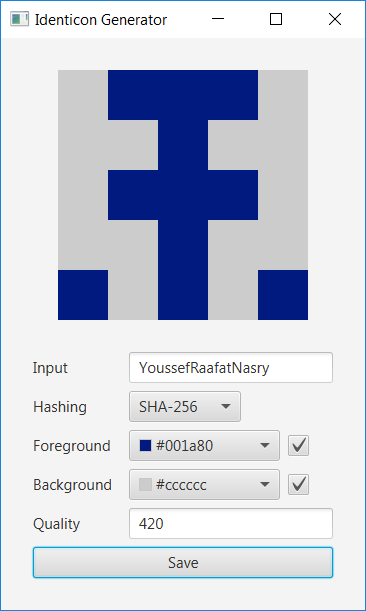

# Identicon Generator

An [Identicon](https://en.wikipedia.org/wiki/Identicon) is a visual representation of a hash value, usually of an IP address, that serves to identify a user of a computer system as a form of avatar while protecting the users' privacy. The original Identicon was a 9-block graphic, and the representation has been extended to other graphic forms by third parties.

## Features

- Customizable border width & pixels number.
- Customizable foreground & background colors.
- 3 hashing algorithms.
- Customizable exporting resolution.

    

